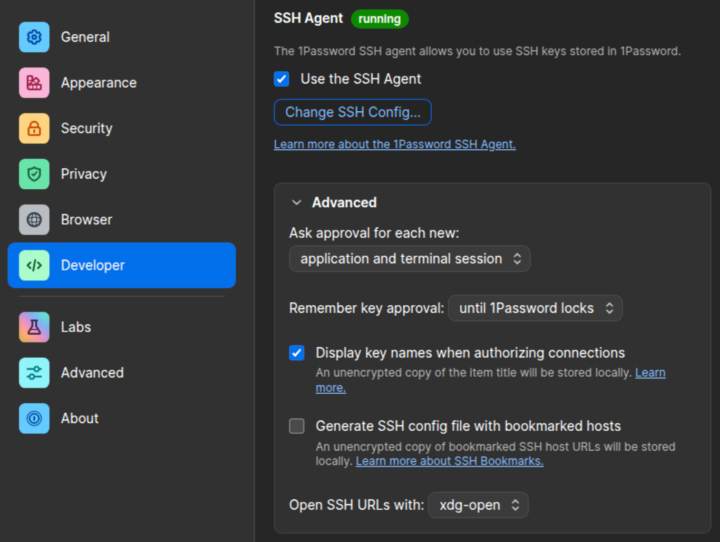
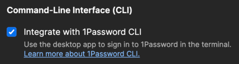
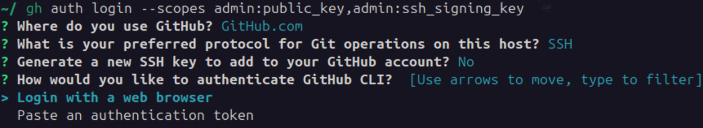
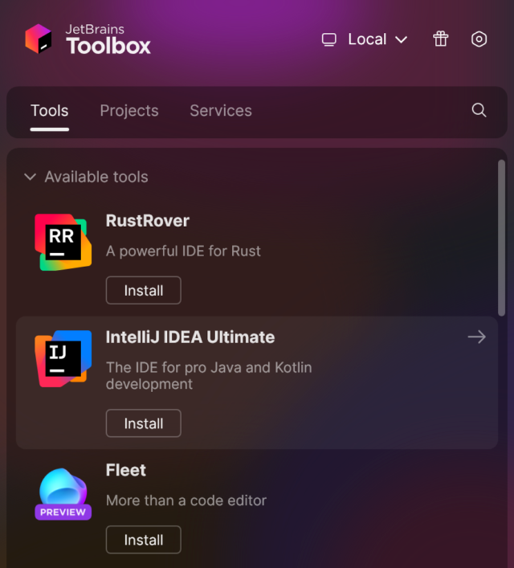
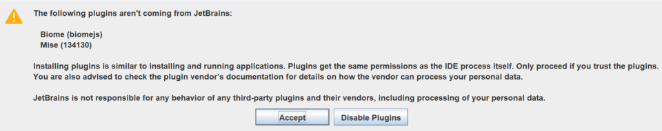
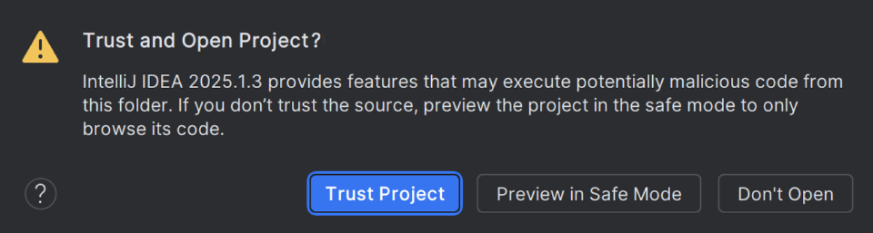
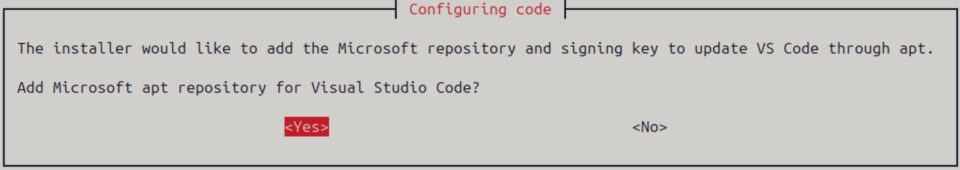
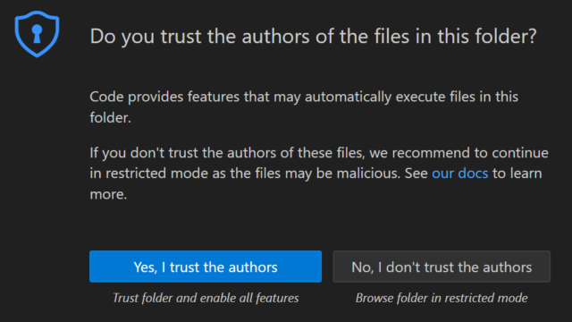
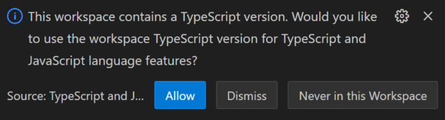

# Get started on 🐧 Ubuntu

This guide describes the necessary steps for you to start coding in this
project.

Last updated: July 26, 2025.

1. [Install Zsh and essential packages](#-1-install-zsh-and-essential-packages)
2. [Generate SSH keys](#-2-generate-ssh-keys)
3. [Install Git and GitHub CLI](#-3-install-git-and-github-cli)
4. [Prepare your workspace](#-4-prepare-your-workspace)
5. [Install an IDE](#-5-install-an-ide)

> [!IMPORTANT]  
> This guide assumes that you are using:
> - Ubuntu 24.04 (Noble Numbat) or newer.
>
> You must complete the guide in [Zsh](https://zsh.sourceforge.io) in a _single_
> shell session (i.e. the same terminal tab), as some steps rely on variables
> set in earlier steps.

> [!TIP]  
> This guide may use `\` line continuations in multi-line commands to let you
> copy, paste, and run them as one.

## 🐧 1. Install [Zsh](https://zsh.sourceforge.io) and essential packages
1. Install [jq](https://jqlang.org), [yq](https://mikefarah.gitbook.io/yq), and
   Zsh:
   ```shell
   sudo apt update && \
   sudo apt install jq zsh && \
   sudo snap install yq
   ```

2. Verify that all installations succeeded:
   ```shell
   jq --version # -> 1.7.0 or newer
   ```
   ```shell
   yq --version # -> 4.46.0 or newer
   ```
   ```shell
   zsh --version # -> 5.9 or newer
   ```

3. Set Zsh as the default shell the next time you log in to Ubuntu:
   ```shell
   chsh -s "$(which zsh)"
   ```

4. Open Zsh and configure `~/.zshrc`, e.g. by using the recommended settings:
   ```shell
   zsh
   ```

> [!TIP]  
> You can upgrade all packages manually:
> ```shell
> sudo apt update && sudo apt upgrade && sudo snap refresh
> ```

## 🐧 2. Generate [SSH keys](https://docs.github.com/en/authentication/connecting-to-github-with-ssh/about-ssh)
### Using [1Password](https://1password.com)
> [!NOTE]  
> 1Password requires a subscription.

1. [Download](https://1password.com/downloads/linux) 1Password for
   Debian/Ubuntu (`.deb`) and save it in the `~/Downloads/` directory.

2. Install 1Password:
   ```shell
   OP_FILENAME="$(basename "$(ls -t ~/Downloads/1password-*.deb | head -1)")" && \
   sudo apt install "$HOME/Downloads/$OP_FILENAME"
   ```

3. Launch 1Password and sign in with your 1Password account.

4. [Enable](https://developer.1password.com/docs/ssh/get-started/#step-3-turn-on-the-1password-ssh-agent)
   the SSH agent in 1Password:  
   Go to **Settings** (<kbd>Ctrl</kbd><kbd>,</kbd>) › **Developer** › **Set up
   the SSH agent** › **Use key names**.  
   Select **Use the SSH agent**.

   

5. [Configure](https://developer.1password.com/docs/ssh/get-started/#step-4-configure-your-ssh-or-git-client)
   the SSH client to use the SSH agent in 1Password:
   ```shell
   mkdir -p ~/.ssh && \
   touch ~/.ssh/config && \
   echo -e "Host *\n  IdentityAgent ~/.1password/agent.sock" >> ~/.ssh/config
   ```

6. [Install](https://developer.1password.com/docs/cli/get-started/#step-1-install-1password-cli)
   the 1Password CLI:
   ```shell
   curl -sS https://downloads.1password.com/linux/keys/1password.asc | \
   sudo gpg --dearmor --output /usr/share/keyrings/1password-archive-keyring.gpg && \
   echo "deb [arch=$(dpkg --print-architecture) signed-by=/usr/share/keyrings/1password-archive-keyring.gpg] https://downloads.1password.com/linux/debian/$(dpkg --print-architecture) stable main" | \
   sudo tee /etc/apt/sources.list.d/1password.list && \
   sudo mkdir -p /etc/debsig/policies/AC2D62742012EA22/ && \
   curl -sS https://downloads.1password.com/linux/debian/debsig/1password.pol | \
   sudo tee /etc/debsig/policies/AC2D62742012EA22/1password.pol && \
   sudo mkdir -p /usr/share/debsig/keyrings/AC2D62742012EA22 && \
   curl -sS https://downloads.1password.com/linux/keys/1password.asc | \
   sudo gpg --dearmor --output /usr/share/debsig/keyrings/AC2D62742012EA22/debsig.gpg && \
   sudo apt update && \
   sudo apt install 1password-cli
   ```

7. Verify that the installation succeeded:
   ```shell
   op --version # -> 2.31.0 or newer
   ```

8. [Enable](https://developer.1password.com/docs/cli/get-started/#step-2-turn-on-the-1password-desktop-app-integration)
   the CLI integration in 1Password:  
   Go to **Settings** (<kbd>⌘ Cmd</kbd><kbd>,</kbd>) › **Developer**.  
   Select **Integrate with 1Password CLI**.

   

9. [Generate](https://developer.1password.com/docs/ssh/manage-keys/#generate-an-ssh-key)
   two SSH keys in your 1Password vault; one to authenticate to GitHub and one
   to sign commits.  
   You may replace 'GitHub authentication key' and 'GitHub signing key' with
   names of your choice:
   ```shell
   OP_AUTH_KEY_NAME='GitHub authentication key'
   ```
   ```shell
   OP_SIGN_KEY_NAME='GitHub signing key'
   ```
   ```shell
   GH_AUTH_KEY="$( \
     op item get "$OP_AUTH_KEY_NAME" --fields label='public key' 2>/dev/null || \
     op item create --category ssh --title "$OP_AUTH_KEY_NAME" --format json | jq --raw-output '.fields[] | select(.label=="public key") | .value' \
   )" && \
   GH_SIGN_KEY="$( \
     op item get "$OP_SIGN_KEY_NAME" --fields label='public key' 2>/dev/null || \
     op item create --category ssh --title "$OP_SIGN_KEY_NAME" --format json | jq --raw-output '.fields[] | select(.label=="public key") | .value' \
   )"
   ```

### Using [OpenSSH](https://www.openssh.com)
1. [Generate](https://docs.github.com/en/authentication/connecting-to-github-with-ssh/generating-a-new-ssh-key-and-adding-it-to-the-ssh-agent)
   an SSH key to authenticate to GitHub.  
   You may replace 'id_github_auth' with a name of your choice and enter a
   passphrase to protect the key:
   ```shell
   SSH_AUTH_KEY_FILENAME='id_github_auth'
   ```
   ```shell
   mkdir -p ~/.ssh && \
   echo -e "Host github.com\n  AddKeysToAgent yes\n  IdentityFile ~/.ssh/$SSH_AUTH_KEY_FILENAME" >> ~/.ssh/config && \
   ssh-keygen -t ed25519 -f "$HOME/.ssh/$SSH_AUTH_KEY_FILENAME" && \
   ssh-add "$HOME/.ssh/$SSH_AUTH_KEY_FILENAME" && \
   GH_AUTH_KEY="$(< "$HOME/.ssh/$SSH_AUTH_KEY_FILENAME.pub")"
   ```

2. Generate an SSH key to sign commits.  
   You may replace 'id_github_sign' with a name of your choice and enter a
   passphrase to protect the key:
   ```shell
   SSH_SIGN_KEY_FILENAME='id_github_sign'
   ```
   ```shell
   ssh-keygen -t ed25519 -f "$HOME/.ssh/$SSH_SIGN_KEY_FILENAME" && \
   ssh-add "$HOME/.ssh/$SSH_SIGN_KEY_FILENAME" && \
   GH_SIGN_KEY="$(< "$HOME/.ssh/$SSH_SIGN_KEY_FILENAME.pub")"
   ```

> [!CAUTION]  
> The SSH keys are stored locally in the `~/.ssh/` directory and must be
> transferred manually to other computers.

## 🐧 3. Install [Git](https://git-scm.com) and [GitHub CLI](https://cli.github.com)
1. [Install](https://git-scm.com/downloads/linux) Git:
   ```shell
   sudo add-apt-repository ppa:git-core/ppa && \
   sudo apt update && \
   sudo apt install git
   ```

2. Verify that the installation succeeded:
   ```shell
   git --version # -> 2.50.0 or newer
   ```

3. [Install](https://github.com/cli/cli/blob/trunk/docs/install_linux.md#official-sources)
   the GitHub CLI:
   ```shell
   sudo mkdir -p -m 755 /etc/apt/keyrings && \
   out=$(mktemp) && wget -nv -O$out https://cli.github.com/packages/githubcli-archive-keyring.gpg && \
   cat $out | sudo tee /etc/apt/keyrings/githubcli-archive-keyring.gpg > /dev/null && \
   sudo chmod go+r /etc/apt/keyrings/githubcli-archive-keyring.gpg && \
   sudo mkdir -p -m 755 /etc/apt/sources.list.d && \
   echo "deb [arch=$(dpkg --print-architecture) signed-by=/etc/apt/keyrings/githubcli-archive-keyring.gpg] https://cli.github.com/packages stable main" | sudo tee /etc/apt/sources.list.d/github-cli.list > /dev/null && \
   sudo apt update && \
   sudo apt install gh
   ```

4. Verify that the installation succeeded:
   ```shell
   gh --version # -> 2.75.0 or newer
   ```

5. [Add](https://docs.github.com/en/authentication/keeping-your-account-and-data-secure/githubs-ssh-key-fingerprints)
   the public SSH key of `github.com` to the list of known hosts:
   ```shell
   touch ~/.ssh/known_hosts && \
   echo 'github.com ssh-ed25519 AAAAC3NzaC1lZDI1NTE5AAAAIOMqqnkVzrm0SdG6UOoqKLsabgH5C9okWi0dh2l9GKJl' >> ~/.ssh/known_hosts
   ```

6. [Create](https://cli.github.com/manual/gh_auth_login) an access token that
   grants the GitHub CLI access to your SSH keys.  
   Choose **GitHub.com** and **SSH** as the preferred protocol and skip SSH key
   generation.  
   Then copy the one-time code, trigger the web-based authentication flow on
   github.com, and authorise the GitHub CLI to access your GitHub account:
   ```shell
   gh auth login --scopes admin:public_key,admin:ssh_signing_key
   ```

   

7. [Add](https://cli.github.com/manual/gh_ssh-key_add) the SSH keys to your
   GitHub account.  
   You may replace 'Rainstorm authentication key' and 'Rainstorm signing key'
   with names of your choice:
   ```shell
   GH_AUTH_KEY_NAME='Rainstorm authentication key'
   ```
   ```shell
   GH_SIGN_KEY_NAME='Rainstorm signing key'
   ```
   ```shell
   echo "$GH_AUTH_KEY" | gh ssh-key add - --title "$GH_AUTH_KEY_NAME" && \
   echo "$GH_SIGN_KEY" | gh ssh-key add - --title "$GH_SIGN_KEY_NAME" --type signing
   ```

8. [Revoke](https://cli.github.com/manual/gh_auth_refresh) the access to your
   SSH keys from the GitHub CLI.  
   Copy the one-time code and authorise the GitHub CLI again:
   ```shell
   gh auth refresh --remove-scopes admin:public_key,admin:ssh_signing_key
   ```

9. [Specify](https://github.com/settings/profile) your full name (first and last
   names) in your GitHub profile:

   

10. Declare your identity using your GitHub profile name and noreply email
    address:
    ```shell
    GH_USER="$(gh api user)" && \
    git config --global user.name "$(echo "$GH_USER" | jq --raw-output 'if (.name | test("^\\p{Lu}.*\\s")) then .name else error("Full name must contain at least two words where the first word starts with a capital letter") end')" && \
    git config --global user.email "$(echo "$GH_USER" | jq --raw-output '"\(.id)+\(.login)@users.noreply.github.com"')"
    ```

11. [Sign](https://docs.github.com/en/authentication/managing-commit-signature-verification/about-commit-signature-verification)
    your commits to make GitHub display
    a <span style="border: 1px green solid; border-radius: 4rem; color: green; font-size: smaller; font-weight: bold; padding: 0.25rem 0.5rem;">
    Verified</span> badge next to your commits:
    ```shell
    git config --global user.signingkey "$GH_SIGN_KEY" && \
    git config --global gpg.format ssh && \
    git config --global commit.gpgsign true && \
    git config --global tag.gpgsign true
    ```

12. Enable autosquash suggestions when you rebase interactively:
    ```shell
    git config --global rebase.autosquash true
    ```

## 🐧 4. Prepare your workspace
1. [Install](https://mise.jdx.dev/getting-started.html) mise-en-place and
   activate it in the shell:
   ```shell
   sudo install -dm 755 /etc/apt/keyrings && \
   wget -qO - https://mise.jdx.dev/gpg-key.pub | gpg --dearmor | sudo tee /etc/apt/keyrings/mise-archive-keyring.gpg 1> /dev/null && \
   echo "deb [signed-by=/etc/apt/keyrings/mise-archive-keyring.gpg arch=$(dpkg --print-architecture)] https://mise.jdx.dev/deb stable main" | sudo tee /etc/apt/sources.list.d/mise.list && \
   sudo apt update && \
   sudo apt install mise && \
   echo 'eval "$(mise activate zsh)"' >> ~/.zshrc && \
   eval "$(mise activate zsh)"
   ```

2. Verify that the installation succeeded:
   ```shell
   mise --version # -> 2025.7.0 or newer
   ```

3. [Clone](https://docs.github.com/en/repositories/creating-and-managing-repositories/cloning-a-repository)
   the repository into the directory in which you keep your workspaces.  
   Specify the path to your workspace directory, for example:
   ```shell
   WORKSPACE_ROOT="$HOME/repositories/rainstormy/"
   ```
   ```shell
   REPOSITORY_URL='git@github.com:rainstormy/github-action-validate-commit-messages.git' && \
   DESTINATION_PATH="${WORKSPACE_ROOT%/}/$(basename "$REPOSITORY_URL" .git)/" && \
   git clone "$REPOSITORY_URL" "$DESTINATION_PATH" && \
   cd "$DESTINATION_PATH"
   ```

4. Create a file named `.env.local` in the project root directory to define
   environment variables in your local development environment:
   ```shell
   touch .env.local
   ```

5. [Mark](https://mise.jdx.dev/cli/trust.html) the project configuration as
   trusted:
   ```shell
   mise trust
   ```

6. Install the tools required by the project (including Node.js and pnpm):
   ```shell
   mise install
   ```

7. Verify that both installations succeeded:
   ```shell
   node --version # -> 20.19.0 or newer
   ```
   ```shell
   pnpm --version # -> 10.12.0 or newer
   ```

8. [Pin](https://pnpm.io/settings#saveprefix) packages to an exact version:
   ```shell
   pnpm config --global set save-prefix ''
   ```

9. Install the Node.js packages required by the project and enable its Git
   hooks:
   ```shell
   mise run init
   ```

> [!IMPORTANT]  
> If `pnpm --version` reports an unexpected version, e.g. `9.15.1` or older, it
> may be installed globally via Corepack or npm. Try uninstalling it:
>
> ```shell
> corepack disable && npm uninstall --global pnpm
> ```

## 🐧 5. Install an IDE
### Using [IntelliJ IDEA](https://www.jetbrains.com/idea)
> [!NOTE]  
> IntelliJ IDEA requires a subscription.

1. [Download](https://www.jetbrains.com/toolbox-app) the JetBrains Toolbox App
   for Linux (`.tar.gz`) and save it in the `~/Downloads/` directory.

2. [Install](https://www.jetbrains.com/help/idea/installation-guide.html#toolbox_linux)
   and launch the JetBrains Toolbox App:
   ```shell
   JETBRAINS_TBX_FILENAME="$(basename "$(ls -t ~/Downloads/jetbrains-toolbox-*.tar.gz | head -1)")" && \
   JETBRAINS_TBX_EXTRACTED_PATH="$(tar --list --gzip --file "$HOME/Downloads/$JETBRAINS_TBX_FILENAME" --directory ~/Downloads/ | head -1 | cut -d/ -f1)" && \
   (cd "$HOME/Downloads/$JETBRAINS_TBX_EXTRACTED_PATH/bin/" && ./jetbrains-toolbox)
   ```

3. Launch JetBrains Toolbox and sign in with your JetBrains account.

4. [Install](https://www.jetbrains.com/help/idea/installation-guide.html#toolbox_linux)
   **IntelliJ IDEA Ultimate**, but do not launch it yet. Quit IntelliJ IDEA if
   it is running (<kbd>Alt</kbd><kbd>F4</kbd>).

   

5. [Enable](https://www.jetbrains.com/help/idea/working-with-the-ide-features-from-command-line.html#linux-scripts)
   the CLI integration in IntelliJ IDEA:
   ```shell
   echo 'export PATH="$PATH:$HOME/.local/share/JetBrains/Toolbox/scripts"' >> ~/.zshrc && \
   source ~/.zshrc
   ```

6. [Install](https://www.jetbrains.com/help/idea/install-plugins-from-the-command-line.html)
   the recommended plugins for this project:
   ```shell
   idea installPlugins $(yq --output-format=csv '.project.component.plugin[]."+@id"' .idea/externalDependencies.xml)
   ```

7. [Use](https://git-scm.com/book/en/v2/Customizing-Git-Git-Configuration#_basic_client_configuration)
   IntelliJ IDEA as the default editor in Git to edit commit messages and
   conduct interactive rebases:
   ```shell
   git config --global core.editor 'idea --wait'
   ```

8. Open the project in IntelliJ IDEA:
    ```shell
    idea .
    ```

9. Mark the plugins as trusted:

   

10. [Mark](https://www.jetbrains.com/help/idea/project-security.html) the
    workspace as trusted:
    

11. You're all set &mdash; let the coding begin!

### Using [Visual Studio Code](https://code.visualstudio.com) (VS Code)
1. [Download](https://code.visualstudio.com/Download) Visual Studio Code for
   Debian/Ubuntu (`.deb`) and save it in the `~/Downloads/` directory.

2. Install Visual Studio Code:
   ```shell
   VSCODE_FILENAME="$(basename "$(ls -t ~/Downloads/code_*.deb | head -1)")" && \
   sudo apt install "$HOME/Downloads/$VSCODE_FILENAME"
   ```

3. [Add](https://code.visualstudio.com/docs/setup/linux#_debian-and-ubuntu-based-distributions)
   the Microsoft apt repository and the signing keys:

   

4. Quit Visual Studio Code if it is running (<kbd>Alt</kbd><kbd>F4</kbd>).

5. [Install](https://code.visualstudio.com/docs/configure/command-line#_working-with-extensions)
   the recommended extensions for this project:
   ```shell
   code $(jq --raw-output '.recommendations[] | "--install-extension " + .' .vscode/extensions.json)
   ```

6. [Use](https://git-scm.com/book/en/v2/Customizing-Git-Git-Configuration#_basic_client_configuration)
   Visual Studio Code as the default editor in Git to edit commit messages and
   conduct interactive rebases:
   ```shell
   git config --global core.editor 'code --wait'
   ```

7. Open the project in Visual Studio Code:
   ```shell
   code .
   ```

8. [Mark](https://code.visualstudio.com/docs/editing/workspaces/workspace-trust)
   the workspace as trusted:

   

9. Open any TypeScript file (`.ts` or `.tsx`) and allow using the TypeScript
   version specified for the workspace:

   

10. You're all set &mdash; let the coding begin!
