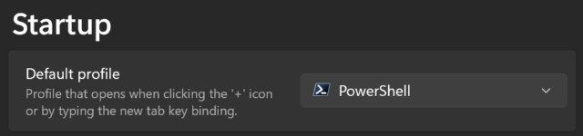
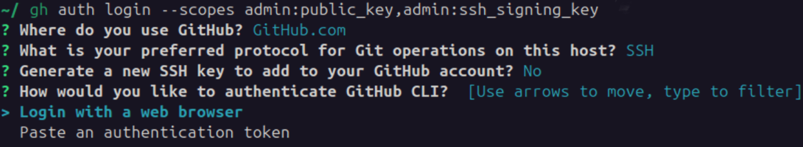
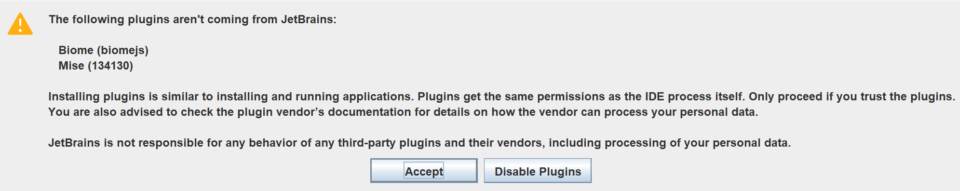

# Get started on 🟦 Windows

This guide describes the necessary steps for you to start coding in this
project.

Last updated: July 26, 2025.

1. [Install the modern PowerShell and essential packages](#-1-install-the-modern-powershell-and-essential-packages)
2. [Generate SSH keys](#-2-generate-ssh-keys)
3. [Install Git and GitHub CLI](#-3-install-git-and-github-cli)
4. [Prepare your workspace](#-4-prepare-your-workspace)
5. [Install an IDE](#-5-install-an-ide)

> [!IMPORTANT]  
> This guide assumes that you are using:
> - Windows 11 or newer.
>
> You must complete the guide in [PowerShell](https://microsoft.com/PowerShell)
> in a _single_ shell session (i.e. the same terminal tab), as some steps rely
> on variables set in earlier steps.

> [!TIP]  
> This guide may use `` ` `` line continuations in multi-line commands to let
> you copy, paste, and run them as one.

## 🟦 1. Install the modern [PowerShell](https://microsoft.com/PowerShell) and essential packages
1. [Install](https://learn.microsoft.com/en-us/powershell/scripting/install/installing-powershell-on-windows#install-powershell-using-winget-recommended)
   PowerShell:
   ```powershell
   winget install --source winget --exact --id Microsoft.PowerShell
   ```

2. [Make](https://learn.microsoft.com/en-us/windows/terminal/customize-settings/startup#default-profile)
   PowerShell the default shell in Windows Terminal:  
   Close and reopen Windows Terminal to make it discover the newly installed
   PowerShell.  
   Go to **Settings** (<kbd>Ctrl</kbd><kbd>,</kbd>) › **Startup**.  
   Set **Default profile** to be _PowerShell_.  
   Press **Save**.

   

3. Start a new PowerShell session.

4. Define a function to refresh the `PATH` environment variable in the current
   shell session:
   ```powershell
   function Refresh-Path { `
     $ENV:PATH = `
       [System.Environment]::GetEnvironmentVariable('Path', 'Machine') + ';' + `
       [System.Environment]::GetEnvironmentVariable('Path', 'User') `
   }
   ```

5. Install [jq](https://jqlang.org) and [yq](https://mikefarah.gitbook.io/yq):
   ```powershell
   winget install --source winget --exact --id jqlang.jq && `
   winget install --source winget --exact --id MikeFarah.yq && `
   Refresh-Path
   ```

6. Verify that both installations succeeded:
   ```powershell
   jq --version # -> 1.8.0 or newer
   ```
   ```powershell
   yq --version # -> 4.45.0 or newer
   ```

> [!TIP]  
> You can upgrade all installed packages manually:
> ```powershell
> winget upgrade --all
> ```

## 🟦 2. Generate [SSH keys](https://docs.github.com/en/authentication/connecting-to-github-with-ssh/about-ssh)
### Using [1Password](https://1password.com)
> [!NOTE]  
> 1Password requires a subscription.

1. [Disable](https://developer.1password.com/docs/ssh/get-started/#step-3-turn-on-the-1password-ssh-agent)
   the OpenSSH Authentication Agent service in Windows:  
   Go to **Services** (<kbd>Win</kbd><kbd>R</kbd> › type `services.msc` › <kbd>
   Enter</kbd>) › **OpenSSH Authentication Agent**.  
   Set the **Startup type** to be _Disabled_.  
   Stop the service if it is currently running.  
   Press **OK**.

   

2. [Download](https://1password.com/downloads/windows) and install 1Password for
   Windows (`.exe`).

3. Launch 1Password and sign in with your 1Password account.

4. [Enable](https://developer.1password.com/docs/ssh/get-started/#step-3-turn-on-the-1password-ssh-agent)
   the SSH agent in 1Password:  
   Go to **Settings** (<kbd>Ctrl</kbd><kbd>,</kbd>) › **Developer** › **Set up
   the SSH agent** › **Use key names**.  
   Press **Set up the SSH agent** again and confirm that the OpenSSH
   Authentication Agent service is disabled.  
   Select **Use the SSH agent**.

   

5. [Install](https://developer.1password.com/docs/cli/get-started/#step-1-install-1password-cli)
   the 1Password CLI:
   ```powershell
   winget install --source winget --exact --id AgileBits.1Password.CLI && `
   Refresh-Path
   ```

6. Verify that the installation succeeded:
   ```powershell
   op --version # -> 2.31.0 or newer
   ```

7. [Enable](https://developer.1password.com/docs/cli/get-started/#step-2-turn-on-the-1password-desktop-app-integration)
   the CLI integration in 1Password:  
   Go to **Settings** (<kbd>Ctrl</kbd><kbd>,</kbd>) › **Developer**.  
   Select **Integrate with 1Password CLI**.

   

8. [Generate](https://developer.1password.com/docs/ssh/manage-keys/#generate-an-ssh-key)
   two SSH keys in your 1Password vault; one to authenticate to GitHub and one
   to sign commits.  
   You may replace 'GitHub authentication key' and 'GitHub signing key' with
   names of your choice:
   ```powershell
   $OP_AUTH_KEY_NAME = 'GitHub authentication key'
   ```
   ```powershell
   $OP_SIGN_KEY_NAME = 'GitHub signing key'
   ```
   ```powershell
   Set-Variable -name GH_AUTH_KEY -value "$( `
     op item get "$OP_AUTH_KEY_NAME" --fields label='public key' 2>$null || `
     op item create --category ssh --title "$OP_AUTH_KEY_NAME" --format json | jq --raw-output '.fields[] | select(.label=="public key") | .value' `
   )" && `
   Set-Variable -name GH_SIGN_KEY -value "$( `
     op item get "$OP_SIGN_KEY_NAME" --fields label='public key' 2>$null || `
     op item create --category ssh --title "$OP_SIGN_KEY_NAME" --format json | jq --raw-output '.fields[] | select(.label=="public key") | .value' `
   )"
   ```

### Using [OpenSSH](https://www.openssh.com)
1. Enable the OpenSSH Authentication Agent service in Windows:  
   Go to **Services** (<kbd>Win</kbd><kbd>R</kbd> › type `services.msc` › <kbd>
   Enter</kbd>) › **OpenSSH Authentication Agent**.  
   Set the **Startup type** to be _Automatic_.  
   Start the service if it is not running.  
   Press **OK**.

   

2. [Generate](https://docs.github.com/en/authentication/connecting-to-github-with-ssh/generating-a-new-ssh-key-and-adding-it-to-the-ssh-agent)
   an SSH key to authenticate to GitHub.  
   You may replace 'id_github_auth' with a name of your choice and enter a
   passphrase to protect the key:
   ```powershell
   $SSH_AUTH_KEY_FILENAME = 'id_github_auth'
   ```
   ```powershell
   New-Item -Path ~\.ssh -ItemType Directory -Force && `
   Add-Content -Path ~\.ssh\config -Value "Host github.com`n  AddKeysToAgent yes`n  IdentityFile ~/.ssh/$SSH_AUTH_KEY_FILENAME" && `
   ssh-keygen -t ed25519 -f "$HOME\.ssh\$SSH_AUTH_KEY_FILENAME" && `
   ssh-add "$HOME\.ssh\$SSH_AUTH_KEY_FILENAME" && `
   Set-Variable -name GH_AUTH_KEY -value "$(Get-Content "$HOME\.ssh\$SSH_AUTH_KEY_FILENAME.pub")"
   ```

3. Generate an SSH key to sign commits.  
   You may replace 'id_github_sign' with a name of your choice and enter a
   passphrase to protect the key:
   ```powershell
   $SSH_SIGN_KEY_FILENAME = 'id_github_sign'
   ```
   ```powershell
   ssh-keygen -t ed25519 -f "$HOME\.ssh\$SSH_SIGN_KEY_FILENAME" && `
   ssh-add "$HOME\.ssh\$SSH_SIGN_KEY_FILENAME" && `
   Set-Variable -name GH_SIGN_KEY -value "$(Get-Content "$HOME\.ssh\$SSH_SIGN_KEY_FILENAME.pub")"
   ```

> [!CAUTION]  
> The SSH keys are stored locally in the `~\.ssh\` directory and must be
> transferred manually to other computers.

## 🟦 3. Install [Git](https://git-scm.com) and [GitHub CLI](https://cli.github.com)
1. Install Git and the GitHub CLI:  
   _(it may request elevated privileges)_
   ```powershell
   winget install --source winget --exact --id Git.Git && `
   winget install --source winget --exact --id GitHub.cli && `
   Refresh-Path
   ```

2. Verify that both installations succeeded:
   ```powershell
   git --version # -> 2.50.0 or newer
   ```
   ```powershell
   gh --version # -> 2.75.0 or newer
   ```

3. [Add](https://docs.github.com/en/authentication/keeping-your-account-and-data-secure/githubs-ssh-key-fingerprints)
   the public SSH key of `github.com` to the list of known hosts:
   ```powershell
   Add-Content -Path ~\.ssh\known_hosts -Value 'github.com ssh-ed25519 AAAAC3NzaC1lZDI1NTE5AAAAIOMqqnkVzrm0SdG6UOoqKLsabgH5C9okWi0dh2l9GKJl'
   ```

4. [Create](https://cli.github.com/manual/gh_auth_login) an access token that
   grants the GitHub CLI access to your SSH keys.  
   Choose **GitHub.com** and **SSH** as the preferred protocol and skip SSH key
   generation.  
   Then copy the one-time code, trigger the web-based authentication flow on
   github.com, and authorise the GitHub CLI to access your GitHub account:
   ```powershell
   gh auth login --scopes admin:public_key,admin:ssh_signing_key
   ```

   

5. [Add](https://cli.github.com/manual/gh_ssh-key_add) the SSH keys to your
   GitHub account.  
   You may replace 'Rainstorm authentication key' and 'Rainstorm signing key'
   with names of your choice:
   ```powershell
   $GH_AUTH_KEY_NAME = 'Rainstorm authentication key'
   ```
   ```powershell
   $GH_SIGN_KEY_NAME = 'Rainstorm signing key'
   ```
   ```powershell
   $GH_AUTH_KEY | gh ssh-key add - --title "$GH_AUTH_KEY_NAME" && `
   $GH_SIGN_KEY | gh ssh-key add - --title "$GH_SIGN_KEY_NAME" --type signing
   ```

6. [Revoke](https://cli.github.com/manual/gh_auth_refresh) the access to your
   SSH keys from the GitHub CLI.  
   Copy the one-time code and authorise the GitHub CLI again:
   ```powershell
   gh auth refresh --remove-scopes admin:public_key,admin:ssh_signing_key
   ```

7. [Specify](https://github.com/settings/profile) your full name (first and last
   names) in your GitHub profile:

   

8. Declare your identity using your GitHub profile name and noreply email
   address:
   ```powershell
   $GH_USER = "$(gh api user)" && `
   git config --global user.name "$($GH_USER | jq --raw-output 'if (.name | test("^\\p{Lu}.*\\s")) then .name else error("Full name must contain at least two words where the first word starts with a capital letter") end')" && `
   git config --global user.email "$($GH_USER | jq --raw-output '"\(.id)+\(.login)@users.noreply.github.com"')"
   ```

9. [Sign](https://docs.github.com/en/authentication/managing-commit-signature-verification/about-commit-signature-verification)
   your commits to make GitHub display
   a <span style="border: 1px green solid; border-radius: 4rem; color: green; font-size: smaller; font-weight: bold; padding: 0.25rem 0.5rem;">
   Verified</span> badge next to your commits:
   ```powershell
   git config --global core.sshCommand 'C:/Windows/System32/OpenSSH/ssh.exe' && `
   git config --global user.signingkey "$GH_SIGN_KEY" && `
   git config --global gpg.format ssh && `
   git config --global commit.gpgsign true && `
   git config --global tag.gpgsign true
   ```

10. Enable autosquash suggestions when you rebase interactively:
    ```powershell
    git config --global rebase.autosquash true
    ```

## 🟦 4. Prepare your workspace
1. [Install](https://mise.jdx.dev/getting-started.html) mise-en-place and
   activate it in the shell:
   ```powershell
   winget install --source winget --exact --id jdx.mise && `
   Refresh-Path && `
   New-Item -Path (Split-Path -Parent "$PROFILE") -ItemType Directory -Force && `
   Add-Content -Path "$PROFILE" -Value 'mise activate pwsh | Out-String | Invoke-Expression' && `
   mise activate pwsh | Out-String | Invoke-Expression
   ```

2. Verify that the installation succeeded:
   ```powershell
   mise --version # -> 2025.7.0 or newer
   ```

3. [Clone](https://docs.github.com/en/repositories/creating-and-managing-repositories/cloning-a-repository)
   the repository into the directory in which you keep your workspaces.  
   Specify the path to your workspace directory, for example:
   ```powershell
   $WORKSPACE_ROOT = "$HOME\repositories\rainstormy\"
   ```
   ```powershell
   Set-Variable -name REPOSITORY_URL -value 'git@github.com:rainstormy/github-action-validate-commit-messages.git' && `
   Set-Variable -name DESTINATION_PATH -value "$(Join-Path "$WORKSPACE_ROOT" "$((Split-Path "$REPOSITORY_URL" -Leaf) -Replace '\.git$','')")" && `
   git clone "$REPOSITORY_URL" "$DESTINATION_PATH" && `
   Set-Location "$DESTINATION_PATH"
   ```

4. Create a file named `.env.local` in the project root directory to define
   environment variables in your local development environment:
   ```powershell
   New-Item .env.local
   ```

5. [Mark](https://mise.jdx.dev/cli/trust.html) the project configuration as
   trusted:
   ```powershell
   mise trust
   ```

6. Install the tools required by the project (including Node.js and pnpm):
   ```powershell
   mise install
   ```

7. Verify that both installations succeeded:
   ```powershell
   node --version # -> 24.12.0 or newer
   ```
   ```powershell
   pnpm --version # -> 10.22.0 or newer
   ```

8. [Pin](https://pnpm.io/settings#saveprefix) packages to an exact version:
   ```powershell
   pnpm config --global set save-prefix ''
   ```

9. Install the Node.js packages required by the project and enable its Git
   hooks:
   ```powershell
   mise run init
   ```

> [!IMPORTANT]  
> If `pnpm --version` reports an unexpected version, e.g. `9.15.1` or older, it
> may be installed globally via Corepack or npm. Try uninstalling it:
>
> ```powershell
> corepack disable && npm uninstall --global pnpm
> ```

## 🟦 5. Install an IDE
### Using [IntelliJ IDEA](https://www.jetbrains.com/idea)
> [!NOTE]  
> IntelliJ IDEA requires a subscription.

1. [Download](https://www.jetbrains.com/toolbox-app) and install the JetBrains
   Toolbox App for Windows (`.exe`).

2. Launch JetBrains Toolbox and sign in with your JetBrains account.

3. [Install](https://www.jetbrains.com/help/idea/installation-guide.html#toolbox_windows)
   **IntelliJ IDEA Ultimate**, but do not launch it yet. Quit IntelliJ IDEA if
   it is running (<kbd>Alt</kbd><kbd>F4</kbd>):

   

4. [Install](https://www.jetbrains.com/help/idea/install-plugins-from-the-command-line.html)
   the recommended plugins for this project:
   ```powershell
   idea installPlugins $(yq --output-format=csv '.project.component.plugin[]."+@id"' .idea/externalDependencies.xml)
   ```

5. [Use](https://git-scm.com/book/en/v2/Customizing-Git-Git-Configuration#_basic_client_configuration)
   IntelliJ IDEA as the default editor in Git to edit commit messages and
   conduct interactive rebases:
   ```powershell
   git config --global core.editor 'idea --wait'
   ```

6. Open the project in IntelliJ IDEA:
    ```powershell
    idea .
    ```

7. Mark the plugins as trusted:

   

8. [Mark](https://www.jetbrains.com/help/idea/project-security.html) the
   workspace as trusted:

   

9. You're all set &mdash; let the coding begin!

### Using [Visual Studio Code](https://code.visualstudio.com) (VS Code)
1. [Download](https://code.visualstudio.com/Download) the Visual Studio Code
   installer for Windows (`.exe`).

2. [Install](https://code.visualstudio.com/docs/setup/windows#_install-vs-code-on-windows)
   Visual Studio Code.  
   Select **Add to PATH** during the installation to enable the CLI integration
   in Visual Studio Code:

   

3. Unselect **Launch Visual Studio Code** after the installation or quit Visual
   Studio Code if it is running (<kbd>Alt</kbd><kbd>F4</kbd>):

   

4. [Install](https://code.visualstudio.com/docs/configure/command-line#_working-with-extensions)
   the recommended extensions for this project:
   ```powershell
   Refresh-Path && `
   code $(jq --raw-output '.recommendations[] | "--install-extension " + .' .vscode/extensions.json)
   ```

5. [Use](https://git-scm.com/book/en/v2/Customizing-Git-Git-Configuration#_basic_client_configuration)
   Visual Studio Code as the default editor in Git to edit commit messages and
   conduct interactive rebases:
   ```powershell
   git config --global core.editor 'code --wait'
   ```

6. Open the project in Visual Studio Code:
   ```powershell
   code .
   ```

7. [Mark](https://code.visualstudio.com/docs/editing/workspaces/workspace-trust)
   the workspace as trusted:

   

8. Open any TypeScript file (`.ts` or `.tsx`) and allow using the TypeScript
   version specified for the workspace:

   

9. You're all set &mdash; let the coding begin!
